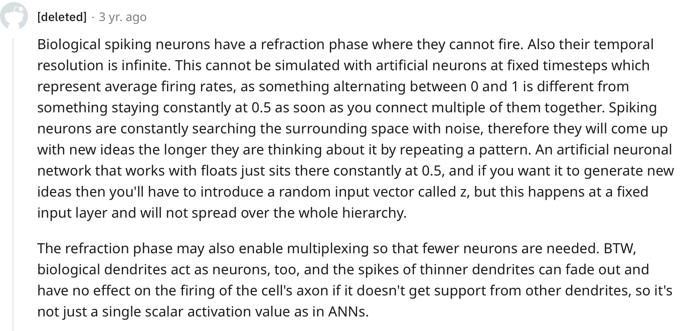

**Reflection**

This was not so much an engineering task as it was a task of understanding the Move compiler and how it handles specifications. All my notes are in the repo's root directory under `bytecode-prover-notes`.

**A bit of context on the Move Prover**

Move is meant to be a "verification-friendly" language and ships with a [logical specification language](https://github.com/move-language/move/blob/main/language/move-prover/doc/user/spec-lang.md) and [formal verification tool](https://github.com/move-language/move/tree/main/language/move-prover).

> A more academic description of the Move Prover can be found [here](https://www-cs.stanford.edu/~yoniz/cav20.pdf).

However, many, if not most, of the contracts on Move chains are closed source, meaning that only the bytecode is available on-chain.

The Move Prover is not meant to work with bytecode. It translates the source code and accompanying specifications into a prover object model then a Boogie representation of that model, which is what is verified, *during* compilation. Specifications, like the invariants we would like to check, cannot be applied to bytecode.

This makes it difficult to use the prover to verify on-chain contracts. Besides making it difficult for end user's to verify the behaviors of the contracts they are interacting with, it also makes it difficult to use the prover to solve for executions that would yield a desired outcome.

> For an example of a verification tool that works with bytecode (EVM not Move), see [Pakala](https://github.com/palkeo/pakala/tree/master). For an example of using the prover to solve for executions that yield a desired outcome, see [this use of Pakala to automate the exploiting of contracts for profit](https://www.palkeo.com/en/projets/ethereum/stealing_ether.html).

** 

**Working backwards**

Inspired by the above use of Pakala to automate scanning for solving for profitable contract executions, I wanted to see if the Move Prover could be used in a similar manner. I was especially intrigued since it seemed like this would be an easier problem to solve given that Move and the Move VM were designed with verification in mind unlike the very verification unfriendly EVM languages and the EVM.

> Profitable contract executions don't necessarily have to be exploits. The simplest ones to solve for just happen to be known simple vulnerabilities that have been left unexploited on old, untouched, and yet to be rediscovered contracts.

But there was a significant problem to solve. I needed to be able to "rewind" compilation up to a point where I could merge separately written specifications with the bytecode to form the prover object model. 

This might seems fairly simple given the above image - it seems like all we have to do is write specifications and merge them with the bytecode. However, there is a complication.

The specifications don't exist in a vacuum. The "bytecode" that is merged into the prover object model carries more data than the bytecode we can pull from the chain - the representations of compiled units of bytecode taken by the prover model are annotated and *dependent* on the specifications for context. They are representations of the compiled units of code maintained *during* the compilation and model building processes.

> For example, if we're referring to a variable in a function in the source code in the written specification, the specification the prover object model receives will need context to draw the proper connections to the corresponding bytecode (or representation of the bytecode).

**A rough overview of compilation**

The compilation of Move source code can be divided into these steps:
- Parsing
- Expansion
- Naming
- Typing
- HLIR (High Level Intermediate Representation)
- CFGIR (Control Flow Graph Intermediate Representation)
- To Bytecode

The most important step/representations here are Expansion and To Bytecode.

Expansion is where we take the parsed source code *and specifications* and create an expanded AST representation (this holds the specifications).
The expansion AST is what is ultimately merged with the annotated compiled units of code to create the prover model.

To Bytecode is where we ultimately compile things to `AnnotatedCompiledUnit`s.

> The function that does the merging is `run_spec_checker()` in the [`move_model` library](https://github.com/move-language/move/blob/ea70797099baea64f05194a918cebd69ed02b285/language/move-model/src/lib.rs#L479).

Sadly for us, when we're working with a raw bytecode file, there is no provided way to get `AnnotatedCompiledUnit`s. However, we are provided with a means of viewing bytcode to get `CompiledUnit`s which takes a little work to convert to `AnnotatedCompileUnit`. I wrote the mean of converting the bytecode view we're given to the representation we can merge with the expanded AST.

I also wrote a lib to work backwards from that representation to get an expanded AST with no specifications attached (those we can inject later).

Most of the difficulty here was in resolving types (backwards).

**Limitations**
I didn't further pursue using these libraries to build a tool to automatically scan contracts for foritable executions after discovering the limits of Boogie and its underlying verifier and SMT solver. 

-- Elaborate on this --